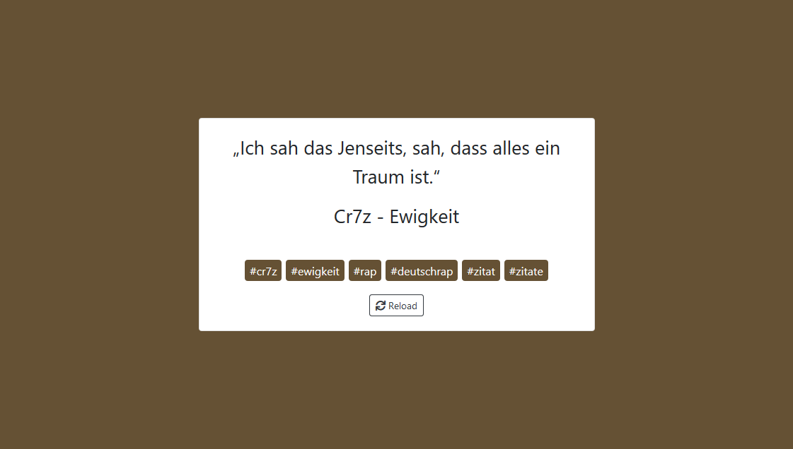

# Quotlr

### Load random quote from Tumblr blog. 📘✏️



### Create `.env` file in root directory

```
TUMBLR_CONSUMER_KEY: "jKJ.....RTMp",
TUMBLR_CONSUMER_SECRET: "9b9.....ArnX",
TUMBLR_TOKEN: "frg.....R5nV",
TUMBLR_TOKEN_SECRET: "Ow1.....yNDD"
```

### Install app

```bash
$ npm install
$ npm run build
$ npm run start
```

Got to <http://localhost:8080>
